# Cordova Progress-Indicator Plugin#
This plugin allows you to show a native Progress Indicator on iOS and Android

# Install

```
cordova plugin add cordova-plugin-indicator
```

## Screenshots

iOS

|Simple|Label|Label-Detail|Success|Text Top|Text Botom|
|------|-----|------------|-------|--------|----------|
|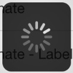|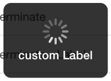|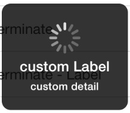|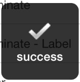|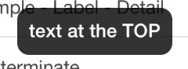|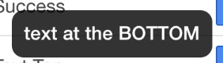


|Determinate|Determinate Label|Annular|Annular Label|Bar|Bar Label|
|-----------|-----------------|-------|-------------|---|---------
|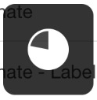|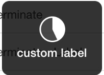|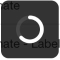|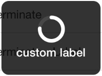|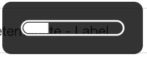|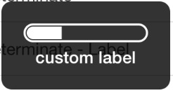


### CREDITS

 - [MBProgressHUD](https://github.com/jdg/MBProgressHUD)
 - [Cordova-progressIndicator](https://github.com/pbernasconi/cordova-progressIndicator)
 - [Cordova-pDialog](https://github.com/pwlin/cordova-plugin-pdialog)
 - [AndroidProgressHUD](https://github.com/anupamdhanuka/AndroidProgressHUD)
 
#### License

Apache license 2.0 - Use this plugin for any production / development needs, and if you'd like to make an attribution to me somewhere.
